# Comparing Sequential Models for Mobile Network Traffic Forecasting

**Telecom Italia call-detail records for Milan, November 2013 to January 2014**

Mahamatbt

---

## Abstract

Mobile network operators have to set aside radio and backhaul capacity before the demand shows up. This makes short-term traffic forecasting a real operational need. In this study I compare three different models for one-step-ahead (10-minute) forecasting of mobile internet activity in Milan. The models are a dynamic harmonic regression with ARIMA errors, a long short-term memory (LSTM) network, and a gradient-boosted tree model (LightGBM). I test them on the week of 16–22 December 2013, using the three busiest hotspots in the network.

The raw data was 19.38 GiB of call-detail records. I turned it into a 340.58 MiB matrix with a streaming pipeline whose memory use does not grow with the size of the dataset. The exploratory analysis found two seasonal cycles at the same time, carrying 82.9% and 10.0% of the variance. It also found a lag-1 autocorrelation of 0.987. That is high enough to make a plain "repeat the last value" forecast (persistence) hard to beat. It also means a flexible model could end up just copying its input.

The dynamic harmonic regression had the lowest mean MASE (0.202) across the three hotspots. The LSTM ensemble matched it (0.202) and LightGBM was close behind (0.209). In this dense city core, all three models beat the persistence baseline (0.238). On the holiday period, which I never used for tuning, persistence won outright on two of the three areas and the learned models got much worse. A separate check showed that no model had collapsed into persistence. Cost also flips between training and use. The smallest and most accurate model is about 1,825 times slower per forecast than the LSTM, and at full-grid scale it could not keep up with the forecast interval.

---

## 1. Introduction

Mobile operators face a scheduling problem with a short deadline. They must commit radio resources, backhaul capacity and base-station power before the demand arrives. A wrong guess costs something in both directions. If they provide too little, users get poor service. If they provide too much, they waste energy and money. Good short-term forecasts make it possible to plan ahead. They also support techniques such as balancing load between cells and putting lightly used base stations to sleep at quiet times [5].

I look at this problem using activity data that Telecom Italia collected across Milan between 1 November 2013 and 1 January 2014 [1], [11]. The city is split into a 100 × 100 grid of 235 m square cells, and internet activity is recorded every 10 minutes. That gives 8,928 observations for each of the 10,000 areas over the two months. The dataset is public and widely used, so results on it can be compared across studies. That is not true of private operator data.

The research question is:

> **How do different sequential models compare for one-step-ahead mobile network traffic
> forecasting under extreme load, and how does their performance vary across the
> network's busiest geographical hotspots?**

The question has two parts, and the second is easy to overlook. Comparing models on one series only tells you which algorithm fits that series. So I treated the choice of areas as part of the method. The heaviest load in the network sits in the very busiest cells, which makes them the most important to forecast well. I therefore focus on the three highest-traffic cells in Milan. All three are in a dense hotspot near the Duomo. The test is whether the models can handle the network's hardest conditions and its peak loads.

I implement and compare three models: a dynamic harmonic regression with ARIMA errors, an LSTM network, and a gradient-boosted tree model (LightGBM). I picked them in Section 2 because they differ in what they *assume*, not just in how they are built. The first is told the seasonal structure directly. The second learns from a raw sequence. The third learns from features I build by hand. Persistence and seasonal-naive baselines appear in every results table as the reference floor.

This report makes four contributions:

- It describes how I turned 19.38 GiB of raw call-detail records into a matrix small enough to model.
- It describes the data, and what a forecasting model has to be able to represent.
- It compares three very different models on the areas with the heaviest load.
- It looks at where those models fail, including a held-out period that covers Christmas and New Year.

---

## 2. Related Work and Model Selection

### 2.1 The problem and this dataset

Wang *et al.* [5] survey cellular traffic prediction. They list resource allocation, load balancing and base-station sleep scheduling as the usual reasons for doing it. They also note that 5G has made traffic volumes and patterns harder to model than before.

The dataset I use is in an unusual position. Barlacchi *et al.* [1] released it as part of the Telecom Italia Big Data Challenge. Because it is public, large and spatially detailed, it has become a common benchmark. Two earlier studies use the same Milan grid. Zhang and Patras [3] forecast traffic across the whole network with a spatio-temporal neural network. They treat the grid like a sequence of images and combine convolutional and recurrent parts. They report up to 61% lower error than established baselines at horizons up to ten hours. Santos *et al.* [4] work on the short-horizon problem that I look at. They compare LSTM and GRU with Random Forest and Decision Tree on two months of Milan data, and they group cells by activity level before modelling.

Santos *et al.* is the closest published study to mine. Their grouping step is worth noticing. They also found that cells differ too much to be treated all the same. I reach the same conclusion from a different direction in Section 4.2.

### 2.2 Statistical approaches, and why the obvious one fails here

ARIMA and its seasonal version SARIMA are the standard statistical baselines, and much of the cellular forecasting literature is written against them. Azari *et al.* [2] give the most careful comparison. They test LSTM against ARIMA on real network traffic and find LSTM better in general. They also find conditions where ARIMA comes close to optimal at much lower complexity. A study that dropped statistical models because of the headline result alone would be ignoring what that paper actually concludes. As Section 6 shows, my results support the qualification, not the headline.

Still, seasonal ARIMA does not work on this data, for a structural reason. At 10-minute resolution the daily period is *s* = 144. At that size, SARIMA's seasonal differencing and parameter estimation become too slow to run. There is a bigger problem too. SARIMA handles **one** seasonal period, and the decomposition in Section 4.4 finds two.

The usual fix is **dynamic harmonic regression**. Fourier terms at the seasonal frequencies go in as exogenous regressors, and ARIMA errors capture whatever is left. Hyndman and Athanasopoulos [6] recommend this for long seasonal periods and for multiple seasonalities. The decomposition method I use, MSTL, comes from the same body of work. Bandara *et al.* [7] introduce it as an extension of STL for multiple seasonal patterns, and they wrote it for high-frequency data like mine.

### 2.3 Deep learning: what it does and does not give you

The survey by Wang *et al.* [5] shows the field moving toward deep learning, and nobody disputes that direction. Three points matter for this study.

**The spatial architectures solve a different problem.** Zhang and Patras [3] get their gains by using the whole grid, since neighbouring cells carry information when users move between them. My study is univariate by design. That is a real limitation, not a neutral choice. Section 8 names spatial extension as the most promising future direction, with [3] as evidence that it helps.

**Nobody has settled which recurrent architecture is best.** Santos *et al.* [4] find LSTM and GRU both work on this dataset, and GRU is cheaper. Choosing LSTM is a reasonable default, not a finding, and I treat it that way.

**Data hunger is a known weakness.** The survey literature notes that LSTM models generalise poorly when data is thin. I train on 5,472 observations per area. That is enough, but not plentiful. So I use early stopping and a regularisation search instead of assuming a large model will behave.

### 2.4 Gradient-boosted trees as a serious competitor

The strongest reason not to assume a neural model will win comes from outside the networking literature. Makridakis *et al.* [8] reviewed the M5 forecasting competition. They found that machine-learning methods beat classical statistical ones, and the winning methods were mostly gradient-boosted trees, with LightGBM [9] the most used model among the winners. So gradient boosting on lag features is not a weak third option added for variety. Santos *et al.* [4] tried Random Forest and Decision Tree on this dataset but not gradient boosting. That leaves a gap, and my study fills it.

### 2.5 How to measure accuracy

Hyndman and Koehler [10] show that many common accuracy measures break down in situations that come up all the time. They propose the mean absolute scaled error (MASE) as a general-purpose alternative. MASE does not depend on scale, and it is easy to read: a value below 1 means the model beats a naive one-step forecast on the training data. I need that property because the three areas differ by roughly fivefold in mean volume. MAPE needs a warning instead of silent use, because it is undefined at zero and unstable near it. The three areas have minimum values of 47.3, 55.8 and 80.2, so no near-zero denominators come up. I checked this instead of assuming it.

### 2.6 The resulting line-up

| Model | What it assumes | Why it is included |
|---|---|---|
| Dynamic harmonic regression | The seasonal form is given directly | The approach [6] recommends for multiple long seasonal periods; the only model here that states the structure instead of learning it |
| LSTM | Nothing about seasonal form | Learns from a raw window; the most common architecture in the single-cell literature [4], [5] |
| LightGBM | The structure is in hand-built lags | Beat both alternatives at scale in M5 [8], [9]; fills the gap left by [4] on this dataset |

The three models differ in what they assume. That is what makes the comparison useful. Otherwise it would only be a contest between implementations.

---

## 3. Dataset and Data Preparation

### 3.1 The data

The dataset is 62 tab-separated text files, one per day, totalling **19.38 GiB** (20,804,803,507 bytes). Each file is between 265 and 359 MiB. Each record has a square identifier, an interval start time in epoch milliseconds, a country code for the other party, and five activity measures. `internet` is the target variable.

Three things about the raw format decided the whole processing design. I found each one by looking at the data, not by assuming.

**Records are split by country code.** A single `(square_id, time_ms)` pair appears once for every country that produced traffic in that cell and interval. On average that is 3.6 times, and at most 36. So adding up over country is not just tidying. It is the step that gives the quantity I actually want. Over the whole period, **319,896,289 raw records** reduce to 89,280,000 cells.

**Timestamps are in UTC, but the files start at local midnight.** The first record of the 1 November file has the value `1383260400000`, which is `2013-10-31T23:00:00Z`. That is midnight on 1 November in `Europe/Rome`, because Italy was on CET. If I had treated the timestamps as UTC days, every daily pattern would have shifted by an hour. No daylight-saving change falls inside the observation window (Italy changed clocks on 27 October 2013 and 30 March 2014). So every local day has exactly 144 intervals. I checked this in the code when building the matrix.

**The target is normalised activity, not an integer count.** Values like `11.028366381681026` appear throughout. The measure is a normalised activity index built from call-detail records, and this report calls it that.

### 3.2 Processing strategy

After adding up the countries the data is small. The full `8928 × 10000` matrix takes **340.58 MiB** as `float32`. So the hard part is not storing the result. It is getting there: turning 19.38 GiB of text into a matrix without ever holding more than one day in memory.

I only need three of the eight columns. The pipeline keeps `square_id`, `time_ms` and `internet` when it reads the file, so five-eighths of the data is thrown away before it is loaded. It uses the smallest data types that fit (`uint16`, `int64`, `float32`) and sums over country code in a single pass. Each day becomes a dense `144 × 10000` block of 5.49 MiB, which is written to disk before the next day is read.

I built three strategies and measured them, instead of assuming one was best:

- A naive pandas read, with every column, guessed data types and the whole file in memory. I built this only to measure it, not to use it.
- A chunked pandas version that keeps only the needed columns, uses narrow data types and adds up piece by piece.
- A Polars [13] lazy scan that pushes the column selection into the CSV reader and uses a streaming group-by.

### 3.3 Measured results

Table 1 shows each strategy on the same input. The number I care about is peak resident set size (RSS), not the size of the final table. The peak happens while the file is being parsed and is released before the table is returned. So I sample it on a background thread every 20 ms instead of reading it once at the end.

**Table 1 — Ingest strategies, one day (2013-11-01), local hardware.**

| Strategy | Resident | Peak RSS | Wall time | Scales with days |
|---|---:|---:|---:|---|
| Naive pandas | 295.57 MiB | 633.06 MiB | 5.56 s | **yes** |
| Chunked pandas | 5.49 MiB | 172.55 MiB | 5.86 s | no |
| Polars lazy | 5.49 MiB | 552.22 MiB | 0.95 s | no |

I expected the faster engine to also use less memory. It did not. Polars is about six times faster per day, but its peak is **3.2× higher** than chunked pandas. Its CSV reader loads the whole ~322 MB file into memory before parsing. I tried two fixes and both made things worse. `low_memory=True` reached 559 MiB, and batched reading reached 697–862 MiB depending on batch size. Neither strategy is better on every measure, so I kept both and pick between them with a command-line flag. The full run used Polars. The machine had plenty of memory, and speed was the limit.

The most important number is not peak memory but how memory grows. Holding all 62 days the naive way would need **17.90 GiB** in memory. This is an extrapolation from one day, and I did not run it. Both optimised paths hold one 5.49 MiB block at a time, so their memory use does not depend on how many days there are. The pipeline is O(1) in dataset size, where the naive approach is O(*n*). That difference, more than the ratio of the peaks, is what makes the job possible.

#### A measurement problem worth reporting

An early version of this benchmark ran all three strategies in one process. It reported 544, 184 and 384 MiB for the *same* work. Python and the memory allocators under it do not give freed memory back to the operating system. So the first strategy to run pays for growing the heap, and the later ones look cheaper than they are. Every measurement in this report now runs in a fresh subprocess, and repeated runs agree to within about 2%. I also record the free system memory with each measurement. When memory is tight, the operating system trims working sets and compresses pages. That *lowers* the measured peak RSS and would make the demand look smaller than it is.

### 3.4 Execution environment

I did the processing on a cloud notebook platform, not on my own machine, for a measured reason. My download speed was 0.44 MiB/s (3.7 Mbit/s), which would take about 12.6 hours for the full dataset. The same download on the cloud platform ran at **55.9 MiB/s (469 Mbit/s)** and finished in **5.92 minutes**. That is about 127 times faster. I only need the raw data once, to produce a 340.58 MiB file. So it made more sense to do that step where the bandwidth is, not where I develop the analysis.

The platform also set limits that shaped the pipeline. Scratch storage is wiped when a session ends, and sessions stop after 12 hours. If I had downloaded all 62 files first and only then converted them, a timeout would have wiped every raw file and left nothing. So the pipeline alternates. It downloads a day, converts it, saves the result to persistent storage, and deletes the raw text before starting the next day. Peak disk use stays near the size of one file, not 19.38 GiB. Every finished day is saved, and a resumed run skips it.

**Table 2 — Full ingest run (62 days).**

| Quantity | Value |
|---|---|
| Raw records parsed | 319,896,289 |
| Download | 5.92 min total, 5.73 s/day ± 0.64 |
| Ingest | 1.54 min total, 1.49 s/day ± 0.10 |
| Total wall time | 7.7 min |
| Peak RSS | 574 MiB max, 326 MiB mean |
| Output | 340.58 MiB |

### 3.5 Missing data

Two different things are easy to mix up, so the pipeline handles them separately.

An **absent cell** is a `(square, time)` pair with no record in the raw file. A record only exists where activity was logged. So an absent pair means nothing happened, not that data was lost. I set these cells to 0.0 and report the count. There are **34,682** of them across the period, which is 0.0388% of the 89,280,000 cells.

A **missing interval** is a timestamp that is missing from the grid altogether. That would be real data loss. My plan for this case was to interpolate gaps of up to three intervals and leave longer gaps as `NaN`, with the count reported. If any gap fell inside the evaluation week, the code was to stop with an error instead of filling it in. In the end, the matrix has **zero missing intervals and zero `NaN` values**. The timestamp grid is complete, every local day has exactly 144 intervals, and the plan never ran.

Absent cells are not spread evenly across the period. They stay near 22 per day until 21 November, step up around 23 November, and reach 1,463 per day over Christmas. They peak at **2,267 on 26 December** (Santo Stefano). By split, the average is 220 per day in training, 864 in the test week, and 1,463 in the held-out stress period. That is about four times more empty cells in evaluation than in training. Raw record counts over the same window fall smoothly by 6.7%, with no step. So quiet outer cells are going completely silent as overall activity drops. It is not a collection failure. The pattern follows human activity, and it peaks over the holidays. That supports reading absent cells as silence. It does not affect the forecasting experiments, because the three areas I model have no zero value at any point in any split. Their minimums are 47.3, 55.8 and 80.2.

### 3.6 Reproducibility

All settings (paths, dates, split boundaries, preprocessing) are in one YAML file. It is loaded into fixed structures with strict checks. Unknown keys are rejected, and the four splits must be back to back, must not overlap, and must sit inside the observation period. The logic is in a library covered by 501 tests, and the notebooks only import from it and draw figures. The processed files other than the full matrix total about 600 KB and are under version control. So the exploratory analysis, the modelling steps and every figure in this report can be rebuilt from a clean checkout without repeating the 19.38 GiB download. Appendix A gives the steps and how I checked them.

---

## 4. Exploratory Analysis

### 4.1 How traffic is spread across the city

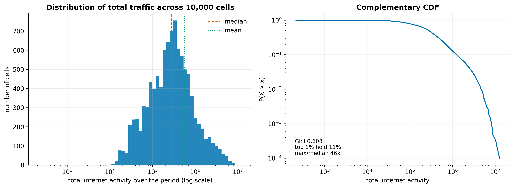

**Figure 1 —** Distribution of total internet activity across the 10,000 cells. The left panel is a histogram on a log axis. The right panel is the complementary cumulative distribution function on log axes. I use log scales because cell totals range across almost five orders of magnitude, from 213.6 to 12,740,060. On a linear axis nearly the whole grid would fall into the first bin.

The distribution is strongly skewed to the right (skewness 4.26, excess kurtosis 25.50). The mean is 555,289 and the median is 277,871, and the maximum is 45.8 times the median. Traffic is concentrated, but not extremely so. The Gini coefficient is **0.608**. The busiest 1% of cells carry **11.0%** of all traffic, the top 10% carry **48.4%**, and the least active half of the grid accounts for **11.6%**. No cell is completely inactive over the period.

A two-parameter lognormal distribution fits the totals with μ = 12.496 and σ = 1.211. A Kolmogorov–Smirnov test rejects this fit at *p* = 4.3 × 10⁻⁵. That result needs some context. The test statistic is 0.0232, against a critical value of 0.0136 at *n* = 10,000 and α = 0.05. That is only 1.7 times the threshold. The log of the totals has a skewness of +0.023 and an excess kurtosis of +0.013, both close to zero. With ten thousand observations the test is powerful enough to reject a largest gap of 2.3 percentage points between the two cumulative curves. For any practical purpose the distribution is lognormal. Quoting the rejection without the statistic would give the wrong impression.

What this means for the study is that traffic volume differs by more than a factor of ten between areas. So absolute error measures like MAE and RMSE cannot be compared across areas. The cross-area comparison in Section 6 uses MASE, which does not depend on scale [10].

### 4.2 Where the busiest cells are, and why it matters

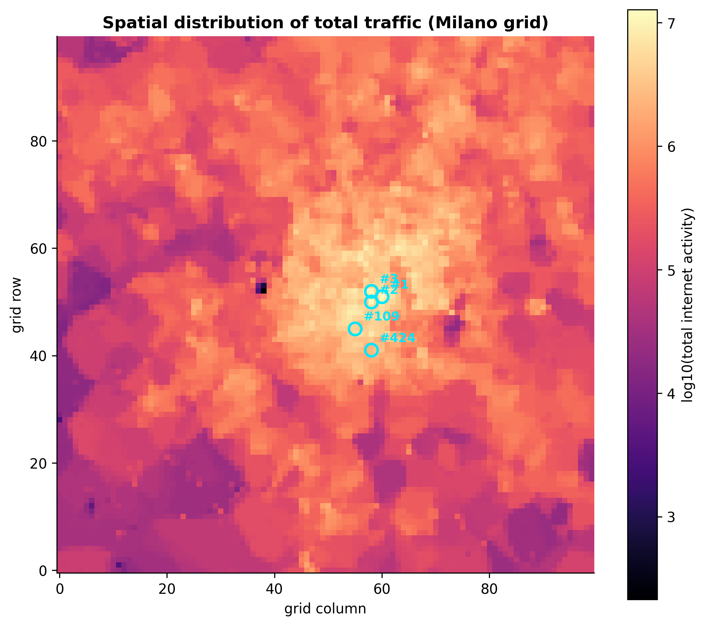

**Figure 2 —** Base-ten logarithm of total activity over the 100 × 100 grid, with the study areas marked. Activity is packed into a compact central region with one sharp peak, and it fades toward the edges.

The three highest-traffic cells are squares **5161, 5059 and 5259**, with totals of 12,740,060, 11,170,854 and 10,485,779. Converting their identifiers to grid coordinates puts them at rows 50–52 and columns 58–60, which is **within 470 m of one another**. The ten busiest cells fit in a box of 13 × 10 cells, about 3.05 × 2.35 km, in central Milan.

This finding decided the design of the study. The heaviest load in the network sits in the very busiest cells, which makes them the most important to forecast well. So I focus on the three highest-traffic cells in Milan. All three are in a dense hotspot near the Duomo. The test is whether the models can handle the network's hardest conditions and its peak loads.

The three areas I model are **square 5161** (rank 1), **square 5059** (rank 2) and **square 5259** (rank 3).

### 4.3 The five series and their characteristics

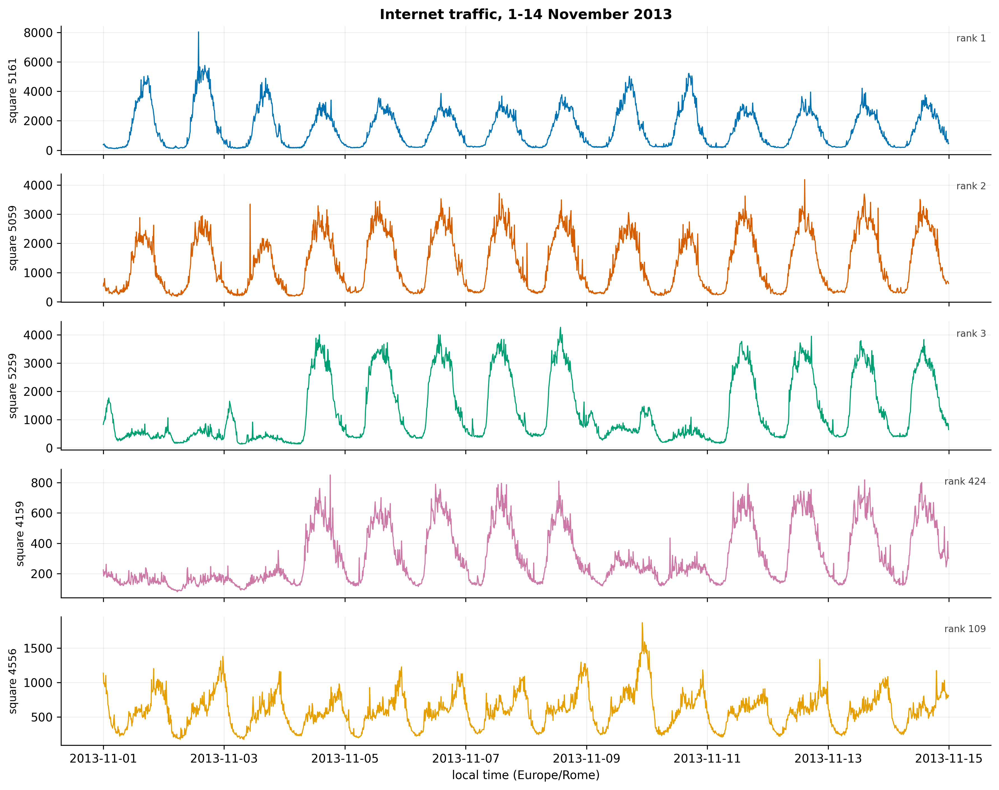

**Figure 3 —** Each of the five areas over the first two weeks of the observation period. Each panel has its own vertical scale. The areas differ by a factor of ten in volume, and a shared scale would squash the smaller ones into a flat line.

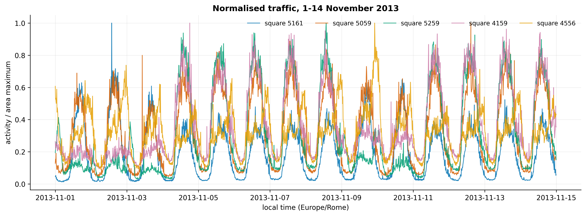

**Figure 4 —** The same five series, each divided by its own maximum. This compares shape, not volume. All five have a clear daily cycle and a clear weekly change. Activity drops overnight and rises through the morning.

**Table 3 — Per-area characteristics over the full period.**

| Square | Rank | Mean | SD | CV | Peak/trough | Night floor ÷ mean | Weekend ÷ weekday |
|---|---:|---:|---:|---:|---:|---:|---:|
| 5161 | 1 | 1,427 | 1,382 | 0.968 | 99.4 | 0.130 | 1.384 |
| 5059 | 2 | 1,251 | 961 | 0.768 | 30.9 | 0.235 | 0.861 |
| 5259 | 3 | 1,174 | 1,103 | 0.939 | 47.0 | 0.333 | 0.425 |

These three areas have the highest traffic volume in the Milan network. Testing the models on them is a tough test of how well they can predict demand where resource planning matters most.

The weekly patterns set the areas apart even more. The grid geometry published with the dataset [12] lets me check this pattern instead of guessing.

**Table 4 — Location of each study area, from the published grid geometry.**

| Square | Centroid (lat, lon) | Nearest reference point | Distance | Weekend ÷ weekday |
|---|---|---|---:|---:|
| 5161 | 45.4655, 9.1934 | Galleria Vittorio Emanuele II | 276 m | 1.384 |
| 5059 | 45.4634, 9.1874 | Duomo | 226 m | 0.861 |
| 5259 | 45.4676, 9.1874 | Teatro alla Scala | 167 m | 0.425 |
| 4159 | 45.4443, 9.1873 | Università Bocconi | 365 m | 0.587 |
| 4556 | 45.4528, 9.1783 | Navigli | 273 m | 1.140 |

Two of the five match their time pattern closely. Square 4556 is 273 m from the Navigli, Milan's main nightlife district. It has the highest night floor of the five and a weekend ratio above one. That is what you would expect from an area that stays busy late and is busier at weekends. Square 4159 is 365 m from Università Bocconi. Its weekend ratio of 0.587, together with a high night floor, is what a university district with many residents would produce.

The three busiest cells are the more interesting result, and they complicate that reading. All three are within 500 m of the Duomo, yet their weekend ratios run from **0.425 to 1.384**. That is a factor of 3.3 between cells only a few hundred metres apart. Square 5259 is closest to Teatro alla Scala and the offices around Piazza della Scala, and it empties out at weekends. Square 5161, next to the Galleria Vittorio Emanuele II, fills up. So being near a landmark tells you something about where a cell is, but it does not fully explain the traffic.

This supports the case from Section 4.2 in a second way. It is not only that the three highest-traffic cells are next to each other. The character of the traffic changes over shorter distances than the volume ranking suggests. So ranking cells by total activity tells you nothing about how they behave over time.

---

### 4.4 Decomposing the seasonal cycles

The figures so far suggest two seasonal cycles at the same time. Classical seasonal decomposition can only handle one. So I decomposed the series for square 5161 with MSTL [7], using periods of 144 intervals (one day) and 1,008 (one week).

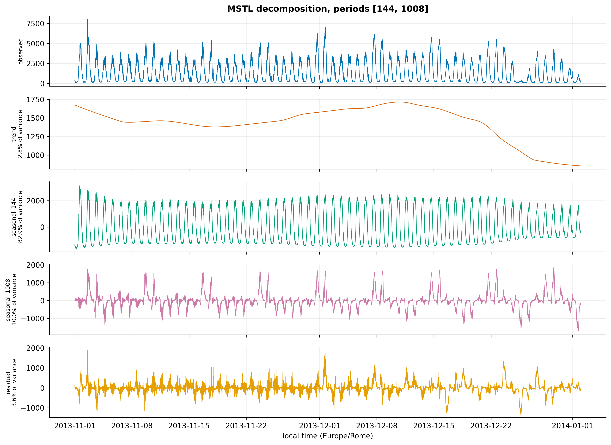

**Figure 5 —** MSTL decomposition of square 5161 into trend, daily seasonality, weekly seasonality and remainder.

**Table 5 — MSTL variance decomposition, square 5161.**

| Component | Share of variance | Strength |
|---|---:|---:|
| Trend | 2.8% | 0.451 |
| Daily seasonality (144) | **82.9%** | **0.959** |
| Weekly seasonality (1008) | 10.0% | 0.746 |
| Residual | 3.6% | — |

Strength is 1 − Var(remainder) / Var(component + remainder). A value near one means the component dominates what is left after the others are removed. The variance shares do not add up to one because the components are correlated.

Three things follow from this. First, the daily cycle dominates, with 82.9% of the variance and a strength of 0.959. Second, the weekly cycle is smaller but still matters, at 10.0% and a strength of 0.746. A model that ignores it throws away real structure. Third, the standard deviation of the residual is only **19% of the observed**. So about four-fifths of the variation is systematic, and a model can in principle capture it.

The effect on modelling is direct. Two seasonal periods are present at once, so the seasonal model has to represent both. That is the case for the dynamic harmonic regression from Section 2.2 [6].

### 4.5 Autocorrelation and stationarity

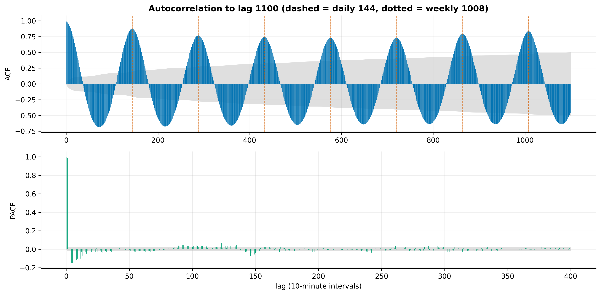

**Figure 6 —** Autocorrelation and partial autocorrelation for square 5161 up to lag 1,100, with the daily and weekly lags marked.

The lag-1 autocorrelation is **0.987**. There are local peaks at lags 144, 288, 432, 720, 864 and 1,008. These are all multiples of the daily period, and the weekly lag is one of them. The autocorrelation is 0.878 at one day and 0.838 at one week. It falls slowly and in waves and does not die out. That is what strong seasonality looks like, not a process with a short memory.

I tested stationarity with the Augmented Dickey–Fuller and KPSS tests together. Their null hypotheses are opposite, so when they agree it tells you more than either one alone.

**Table 6 — Stationarity tests, square 5161.**

| Series | ADF statistic | ADF *p* | KPSS statistic | KPSS *p* | Verdict |
|---|---:|---:|---:|---:|---|
| Raw | −19.03 | 0.0000 | 0.237 | ≥ 0.10 | Stationary (both agree) |
| First difference | −15.16 | 0.0000 | 0.003 | ≥ 0.10 | Stationary (both agree) |
| Seasonal difference (lag 144) | −11.83 | 0.0000 | 0.069 | ≥ 0.10 | Stationary (both agree) |

The KPSS *p*-values are capped at the top of the table range, so 0.10 means "≥ 0.10" and not an exact value.

This result needs careful wording. Both tests say the raw series is stationary, which would normally mean no differencing is needed. I set the harmonic regression to *d* = 0 for this reason. But "stationary" here only means the series has no stochastic trend. The mean still changes a lot with the time of day, as Figure 3 and the decomposition both show. Neither test looks at that, because regular seasonality is not a unit root. Calling the series stationary without saying so would be misleading.

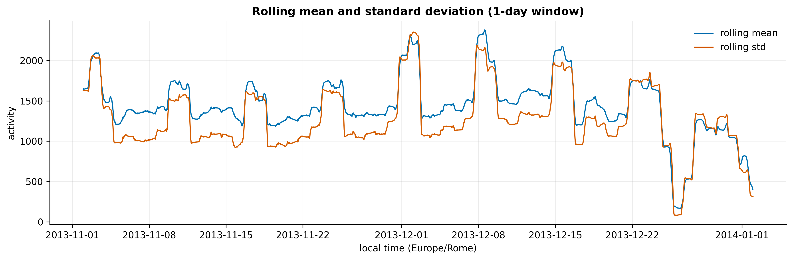

**Figure 7 —** Rolling mean and standard deviation over a one-day window. The overall level is stable, and the changes within each day are still visible.

The very high lag-1 autocorrelation has a second effect. A model can get a low one-step-ahead error just by repeating its latest input. It would look successful without having learned anything. So I report persistence as a baseline in every results table, and Section 7.1 includes a direct check for whether any model has collapsed into it.

### 4.6 Spectral analysis

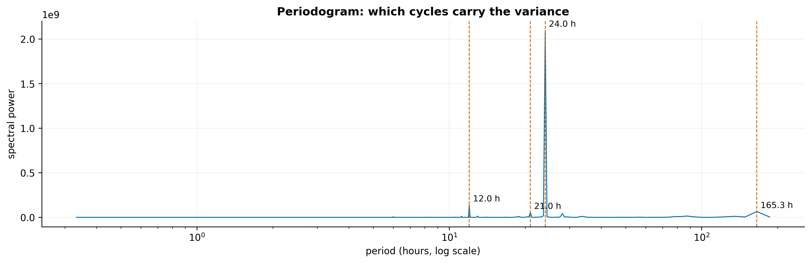

**Figure 8 —** Periodogram against period in hours, with the main cycles marked.

Most of the power is at **24.00 hours**, as expected. There is a large second peak at **12.00 hours**, and another near 165 hours that matches the weekly cycle.

The 12-hour peak is real. It shows that the daily cycle is not a single sine wave. It has structure within the day, which fits separate morning and evening activity. This affects how the model must be set up. A harmonic regression with a single Fourier pair for the daily period would get the outline of the daily cycle but miss its shape. It needs at least two daily harmonics. I choose the exact number from the data in Section 5.5.

### 4.7 Anomalies and the holiday calendar

I looked for intervals where a seasonal-naive forecast fails badly. My reasoning was that periods that are hard for the simplest seasonal model are probably hard for all of them. Finding them in advance also turns the later failure analysis into a prediction I can test, instead of an explanation after the fact.

The detection method needed adjusting. Forecast errors on this series are far from constant in size. The standard deviation of the seasonal-naive residual differs by a factor of **25 between the quietest and busiest hours** of the day. If I estimate one robust scale for the whole series, the quiet hours set it, and it flags every busy hour. At a threshold of four robust standard deviations it flagged 12.7% of all intervals, which tells you nothing. Estimating the scale separately for each position in the daily cycle asks the right question: is this value unusual *for that time of day*? I also tried a `log1p` transform as another fix and rejected it. It cuts the spread ratio to 2.0 but still flags 2.85%. I report errors in the original units, so the original scale is the right one for judging deviations.

With the per-position scale, **152 intervals are flagged**. That is 1.73% of the 8,784 intervals I can evaluate (the first day has no seasonal-naive comparison). Holidays are 12.9% of the days in the period but hold **23.0%** of the flagged intervals. That is **1.78×** more than expected, with *p* = 4.3 × 10⁻⁴ in a binomial test. Both Milan-specific dates show up. One is Sant'Ambrogio on 7 December, the city's patron saint's day, a local holiday that falls on the opening of the La Scala season. The other is the Immacolata on 8 December. A national holiday calendar would have missed the first one.

This is why I include a holiday indicator among the calendar features. A model that only knows the day of the week cannot tell that a Wednesday will behave like a Sunday. It is also why I chose the held-out stress period. 23 December to 1 January holds four of the eight holidays in the observation window, and I keep it for failure analysis.

One case I cannot explain. The worst single day is **Monday 2 December**, with 17 flagged intervals. That is more than Christmas Day (9) or New Year's Day (13), and it is not a holiday. I have not found a cause. I carry it into the failure analysis in Section 7 and do not leave it out.

### 4.8 What this means for the forecasting approach

The exploratory analysis sets six requirements for the modelling approach. Each comes from a measurement.

1. **Two seasonal periods operate at once** (82.9% and 10.0% of variance), so the seasonal model has to represent both. Seasonal ARIMA cannot, and at *s* = 144 it is too slow anyway.
2. **The daily cycle is not a sine wave.** The 12-hour spectral peak means the daily period needs at least two Fourier harmonics.
3. **No differencing is needed for a stochastic trend.** ADF and KPSS agree across all three versions of the series, so *d* = 0.
4. **A lag-1 autocorrelation of 0.987 makes persistence a hard baseline.** It also creates a risk that a flexible model collapses into repeating its input. So I need both a baseline and a direct check.
5. **The autocorrelation peaks at 144, 288, 432, 720, 864 and 1,008.** These give the lag set for a feature-based model, taken from the data and not from convention.
6. **Variance grows with the level.** The correlation between daily mean and daily standard deviation is +0.947 on the raw scale and +0.265 after a `log1p` transform. That justifies applying a variance-stabilising transform before fitting.

---

## 5. Methodology

### 5.1 Problem definition and evaluation protocol

The task is one-step-ahead forecasting. Given observations up to interval *t*−1, predict the internet activity at interval *t*, ten minutes later. The models are univariate. I fit one per area, at the native 10-minute resolution.

Every reported forecast uses walk-forward inference with **true observed history**. The model predicts *t* from real observations up to *t*−1. Then the real value at *t* is revealed before *t*+1 is predicted. This is not a recursive rollout, where a model is fed its own predictions. A rollout would measure multi-step error while calling it one-step-ahead. I use a single walk-forward implementation for all reported results. The batched versions used by LightGBM and the LSTM are tested to give the same output as the step-by-step loop.

I split the period by time, never at random. A random split on a time series puts future observations in the training set.

**Table 7 — Chronological splits.**

| Split | Dates (Europe/Rome) | Points | Purpose |
|---|---|---:|---|
| train | 1 Nov – 8 Dec 2013 | 5,472 | Model fitting; every transform fitted here only |
| validation | 9 – 15 Dec 2013 | 1,008 | Hyperparameter selection |
| test | 16 – 22 Dec 2013 | 1,008 | Reported results |
| stress | 23 Dec 2013 – 1 Jan 2014 | 1,440 | Failure analysis only; never tuned on |

I fit all transforms on the training split only. The scaler raises an error if asked to refit. So leakage stops the code with an error and does not quietly produce results that look better than they are.

### 5.2 Metrics

I report MAE, RMSE, MAPE, sMAPE, R² and MASE. I use MASE to compare across areas, following Hyndman and Koehler [10]. The three areas differ by roughly a factor of ten in volume, so raw errors cannot be compared. An MAE of 83.6 on square 5161 and 13.6 on square 4159 do not tell you which was forecast better. MASE divides each error by the naive in-sample error of that area's own training split. A value below 1 means the model beats a naive forecast, and values can be compared across areas.

I always compute the MASE denominator on the **training** series, including when I score the validation, test and stress splits. Scaling by the window being scored would let an easy week flatter a model.

### 5.3 Baselines

Two baselines appear in every results table.

**Persistence** predicts *x̂*(*t*) = *x*(*t*−1). This is not a weak baseline. Section 4.5 measured a lag-1 autocorrelation of 0.987, and persistence gets a MASE of 0.145 to 0.302 across the three test-week areas, with R² above 0.98. It is the bar that decides whether a model's complexity was worth it.

**Seasonal naive** predicts *x̂*(*t*) = *x*(*t*−144), the same interval one day earlier. It tests whether the daily cycle alone is enough.

### 5.4 The three models

**Dynamic harmonic regression.** Fourier terms for the daily (144) and weekly (1,008) periods go into a SARIMAX model [14] as exogenous regressors. An ARIMA process models the error. The periodogram found a 12-hour component next to the 24-hour one, so at least two daily harmonics are needed, and the search started at *K*₁ = 2. Both stationarity tests agreed there is no unit root, so I kept *d* at 0 throughout. Differencing would have removed signal.

**LSTM.** I built it in PyTorch [15]. It is a stacked LSTM over a window of recent observations, with dropout and a linear output layer. It is the only model here that assumes nothing about seasonal form. The harmonic regression is told the cycle, and LightGBM is told which lags to look at. The LSTM sees a raw window and has to find whatever structure is in it. So it is the only candidate for the behaviour the decomposition could not remove: a residual that is still 3.6% of the variance and varies a lot in size.

**LightGBM** [9]. Gradient-boosted trees on causal lag, rolling and calendar features. I chose the lags from the measured autocorrelation, not from convention: 1, 2, 3, 6, 12, 144, 145, 288 and 1,008. That is the strongest single predictor plus each multiple of the daily period that the ACF picked out. Feature importances then give a way to interpret the model that the other two do not offer.

### 5.5 Input representation, preprocessing and training

The three models read the same series in three different forms. Those differences are the substance of the comparison, not an implementation detail.

**Variance stabilisation and normalisation.** Section 4.8 measured a correlation of +0.947 between daily mean and daily standard deviation. It falls to +0.265 after a `log1p` transform. So error variance grows with the level, which breaks the constant-variance assumption behind squared-error training. All three models therefore fit on `log1p`-transformed values. The LSTM and LightGBM also standardise to zero mean and unit variance. The statistics come from `log1p(x)`, not from `x`. Standardising first and taking logs afterwards would be a different transform and would not invert the same way. I estimate the mean and standard deviation on the **training split only**. The scaler refuses to refit and raises an error if asked. Every reported metric is computed after converting back to original units.

**Calendar features** are used by the LSTM and LightGBM. There are six columns: sine and cosine of minute-of-day, sine and cosine of day-of-week, a weekend flag, and a holiday flag. The holiday flag covers the Italian national calendar and the two Milan-specific dates from Section 4.7. I use the sine and cosine forms and not raw integers, so that 23:50 and 00:00 sit next to each other and not at opposite ends.

**Table 8 — Input representation by model.**

| Model | Input at time *t* | Shape | Target |
|---|---|---|---|
| harmonic ARIMA | 16 Fourier terms (2·*K*₁ daily + 2·*K*₂ weekly) as exogenous regressors; ARIMA(3,0,1) state | (16,) | `log1p(x(t))` |
| LSTM | 144 previous intervals × (1 value + 6 calendar) | (144, 7) | `log1p(x(t))`, standardised |
| LightGBM | 9 lags (1, 2, 3, 6, 12, 144, 145, 288, 1008), 3 rolling means and standard deviations (windows 6, 36, 144), 6 calendar | (27,) | `log1p(x(t))`, standardised |

Every feature is **causal**, meaning it is computed only from observations before *t*. The lag set is the one from the measured autocorrelation in Section 4.5. Lag 1 is the strongest single predictor. The rest are the multiples of the daily period that the ACF marked. Lag 145 is included because it is the daily lag of the previous interval.

**Training.** I train the LSTM with Adam on an L1 objective, which matches the selection metric. I clip the gradient norm at 1.0 and use dropout between layers. Training stops on validation MAE with patience, and I restore the **best checkpoint, not the last one**, because the final epoch is usually not the best. LightGBM also uses an L1 objective, with early stopping on the validation split. I fit the harmonic regression by maximum likelihood. Then I update it through the evaluation window with `append(..., refit=False)`. This takes in each new observation without re-estimating the parameters. That is what makes its walk-forward inference practical, and, as Section 6.4 shows, it is also why its cost per step is high.

### 5.6 Tuning protocol

I tuned on the highest-traffic area only (square 5161), selecting on validation MAE. The search went one axis at a time, carrying the winner forward, so that each decision can be traced. A single joint search would give me a configuration with no explanation for any setting beyond "the optimiser preferred it."

There were three exceptions to the staged pattern, each with a reason:

- **I chose the harmonic orders by AICc, not validation error.** Refitting and walk-forwarding 15 candidates costs far more than an information criterion computed in-sample, and AICc is the standard choice for this.
- **LightGBM used Optuna** over 30 trials. `num_leaves`, `min_child_samples` and the sampling fractions trade off against each other. A staged sweep would fix each one at a value picked while the others were wrong. The search had converged by trial 10. The remaining 20 trials improved validation MAE by 0.6%.
- **The LSTM used five staged sweeps** over sequence length, capacity, optimisation, regularisation, and a calendar-feature ablation. The ablation showed calendar features are worth **14.7%** of validation MAE (98.22 with, 112.67 without).

Each candidate, **101 in total**, adds a row to an append-only experiment log. The row holds its hyperparameters, validation metrics, wall time, parameter count, the source commit, and a non-empty rationale saying what the comparison meant for the next step.

**Table 9 — Selected hyperparameters.**

| Model | Selection |
|---|---|
| harmonic ARIMA | *K*₁ = 6, *K*₂ = 2 Fourier orders; ARIMA(3, 0, 1) |
| LightGBM | 68 leaves, learning rate 0.034, 320 trees after early stopping |
| LSTM | window 144, 128 hidden units × 2 layers, batch 32, dropout 0.0, weight decay 1 × 10⁻⁴ |

Two things about the harmonic selection are worth recording. AICc chose six daily harmonics. That is more than the minimum of two the periodogram called for, so the daily shape has structure down to components of roughly four hours. Also, the whole gain from the ARIMA order came from the moving-average term. Going from (2,0,0) to (2,0,1) cut validation MAE by 3.9%. The three best orders were only 0.08 MAE apart, which is within noise. So ARIMA(3,0,1) won by a margin that cannot tell it apart from the simpler ARIMA(1,0,1).

### 5.7 Final fits

Once the hyperparameters are chosen, the validation split has done its job. Leaving it out would waste a week of data the model should learn from. So the final fit uses train + validation, and I do not touch the test week until prediction.

This causes a problem for the two models that stop early, because no held-out set is left. Refitting with early stopping against the test week would be leakage. Refitting with no stopping rule would overfit. My solution is to carry over the **complexity** found during tuning and not the stopping rule. The LSTM trains for the epoch count that was best on validation, with patience turned off. LightGBM uses the 320 trees that early stopping chose. I fixed both numbers before the final fit, without looking at test data.

I run the LSTM with **three seeds** and report the mean ± standard deviation. One seed gives one draw from a distribution, and here the spread turns out to be about as large as the gaps between models.

### 5.8 Two quantities that are easy to confuse

The results tables show the LSTM twice, and the difference matters.

- **`lstm`** is the mean of the three seeds' errors. It shows what one typical trained model does.
- **`lstm_ensemble`** is the error of the *averaged forecast* of the three seeds. This is a different and better forecast, because averaging predictions cannot make the absolute error larger.

The saved prediction series, and so every figure below, holds the averaged forecast. I report both rows, and I state the ensemble's cost as three fits of training, three passes of inference and three times the parameters.

---

## 6. Results

### 6.1 Accuracy on the test week

**Table 10 — MASE by area, test week (16–22 December 2013). Lower is better; 1.0 is the
in-sample naive forecast.**

| Model | 5161 | 5059 | 5259 | mean | worst |
|---|---:|---:|---:|---:|---:|
| **harmonic ARIMA** | 0.241 | **0.244** | **0.120** | **0.202** | 0.244 |
| LSTM (3-seed ensemble) | **0.233** | 0.255 | 0.120 | 0.202 | 0.255 |
| LightGBM | 0.249 | 0.255 | 0.122 | 0.209 | 0.255 |
| persistence | 0.267 | 0.302 | 0.145 | 0.238 | 0.302 |
| LSTM (mean of 3 seeds) | 0.265 | 0.263 | 0.123 | 0.217 | 0.265 |
| seasonal naive | 0.975 | 0.635 | 0.898 | 0.836 | 0.975 |

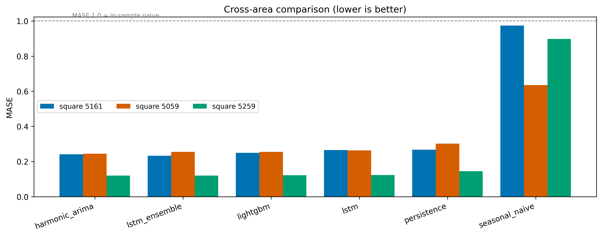

**Figure 9 —** MASE per model, grouped by area, test week. The dashed line marks MASE 1.0, the in-sample naive forecast.

The dynamic harmonic regression has the best mean MASE and the best result on two of the three areas. It beats persistence by **15.1%** on average across areas. On square 5161 the three-seed LSTM ensemble does better, with 0.233 against the harmonic model's 0.241.

On average across areas, **all three models beat persistence**. In the extreme hotspots of the city centre, traffic is more predictable than in the wider network. Seasonal naive is far worse than every other model. So the daily cycle alone is not a good enough forecast at this resolution.

The harmonic model does this with **22 parameters**. LightGBM has 19,639, and a single LSTM has 202,369.

**Table 11 — Full metrics by area, test week.**

| Area | Model | MAE | ± | RMSE | MAPE % | sMAPE % | MASE | R² |
|---|---|---:|---:|---:|---:|---:|---:|---:|
| 5161 | LSTM ensemble | 80.79 | — | 124.49 | 7.61 | 7.57 | **0.233** | 0.9917 |
| 5161 | harmonic ARIMA | 83.64 | — | 128.25 | 7.80 | 7.67 | 0.241 | 0.9911 |
| 5161 | LightGBM | 86.59 | — | 130.89 | 7.97 | 7.81 | 0.249 | 0.9908 |
| 5161 | LSTM | 92.01 | 3.03 | 142.67 | 8.48 | 8.44 | 0.265 | 0.9890 |
| 5161 | persistence | 92.80 | — | 134.88 | 9.19 | 9.10 | 0.267 | 0.9902 |
| 5161 | seasonal naive | 338.59 | — | 619.04 | 25.94 | 22.83 | 0.975 | 0.7934 |
| 5059 | harmonic ARIMA | 66.07 | — | 94.25 | 6.51 | 6.43 | **0.244** | 0.9899 |
| 5059 | LSTM ensemble | 68.81 | — | 97.48 | 6.83 | 6.67 | 0.255 | 0.9892 |
| 5059 | LightGBM | 68.90 | — | 99.69 | 6.63 | 6.52 | 0.255 | 0.9887 |
| 5059 | LSTM | 71.08 | 3.12 | 101.14 | 7.05 | 6.89 | 0.263 | 0.9884 |
| 5059 | persistence | 81.52 | — | 114.38 | 7.96 | 7.91 | 0.302 | 0.9851 |
| 5059 | seasonal naive | 171.74 | — | 245.87 | 18.02 | 16.62 | 0.635 | 0.9313 |
| 5259 | harmonic ARIMA | 62.74 | — | 88.96 | 6.94 | 6.88 | **0.120** | 0.9937 |
| 5259 | LSTM ensemble | 62.87 | — | 90.84 | 6.85 | 6.76 | 0.120 | 0.9934 |
| 5259 | LightGBM | 63.71 | — | 94.33 | 6.83 | 6.63 | 0.122 | 0.9929 |
| 5259 | LSTM | 64.58 | 1.46 | 94.32 | 6.96 | 6.87 | 0.123 | 0.9929 |
| 5259 | persistence | 75.97 | — | 109.58 | 8.11 | 8.07 | 0.145 | 0.9905 |
| 5259 | seasonal naive | 470.32 | — | 861.62 | 71.62 | 42.61 | 0.898 | 0.4093 |

### 6.2 Forecasts against observations

Figures 10–18 show each model against the observed series over the test week, for each area. Each figure shows the full week on top and the busiest single day enlarged below, with persistence drawn on the lower panel. The zoom is there for a reason. At full-week width, a thousand points are squeezed into a few hundred pixels, and every model follows the observed line. A one-step lag only shows up at the larger scale.

**Square 5161 (rank 1, highest traffic).**

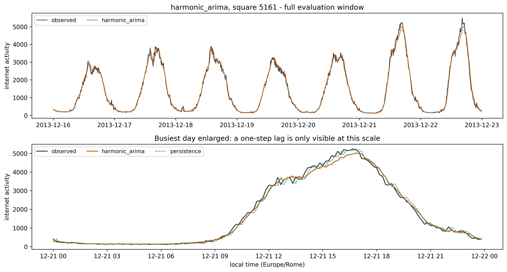
**Figure 10 —** Harmonic ARIMA, square 5161.

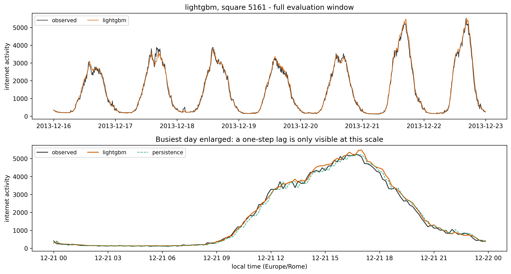
**Figure 11 —** LightGBM, square 5161.

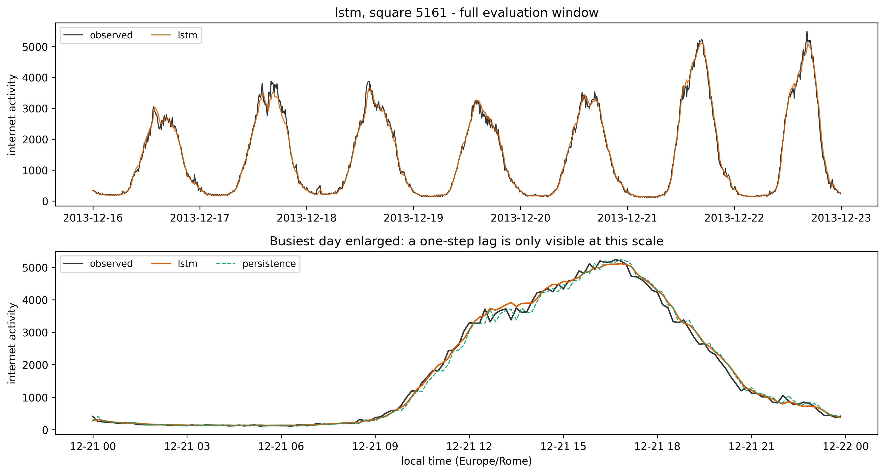
**Figure 12 —** LSTM (3-seed mean forecast), square 5161.

**Square 4159 (rank 424, lowest traffic of the three).**

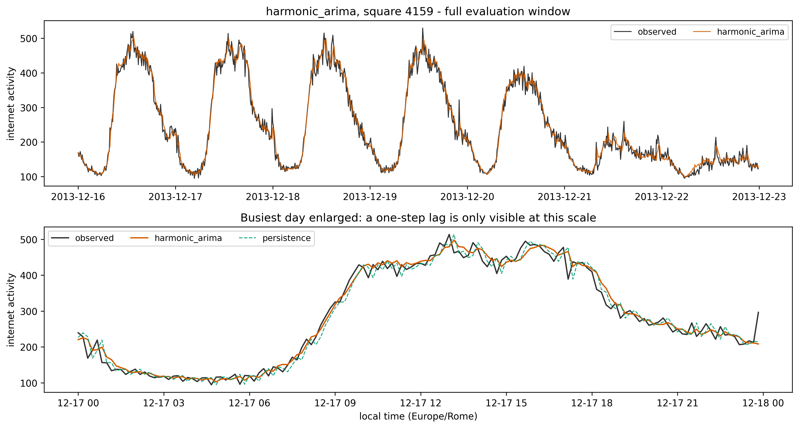
**Figure 13 —** Harmonic ARIMA, square 4159.

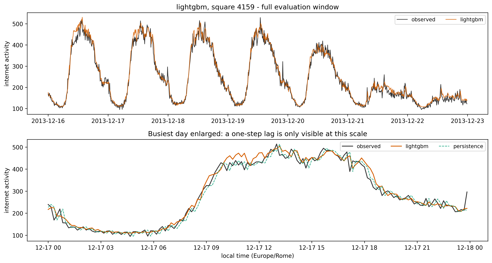
**Figure 14 —** LightGBM, square 4159.

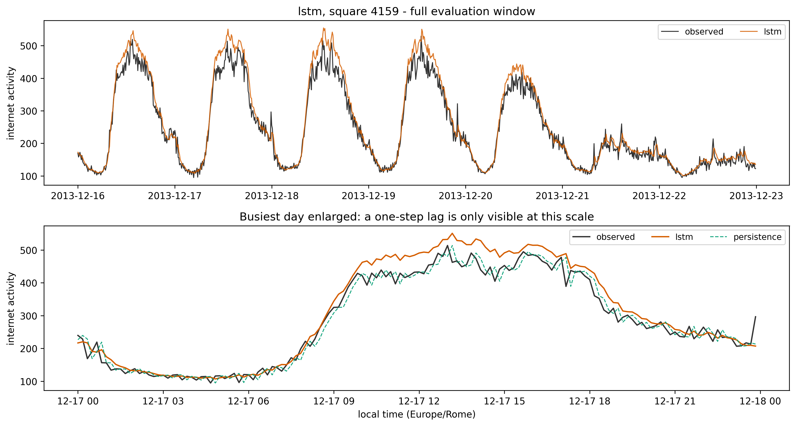
**Figure 15 —** LSTM, square 4159. The morning ramp is where this model fails. See Section 7.2.

**Square 4556 (rank 109, highest night floor).**

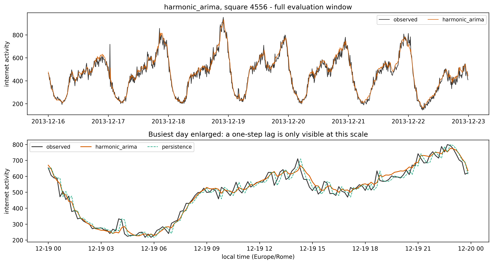
**Figure 16 —** Harmonic ARIMA, square 4556.


**Figure 17 —** LightGBM, square 4556.

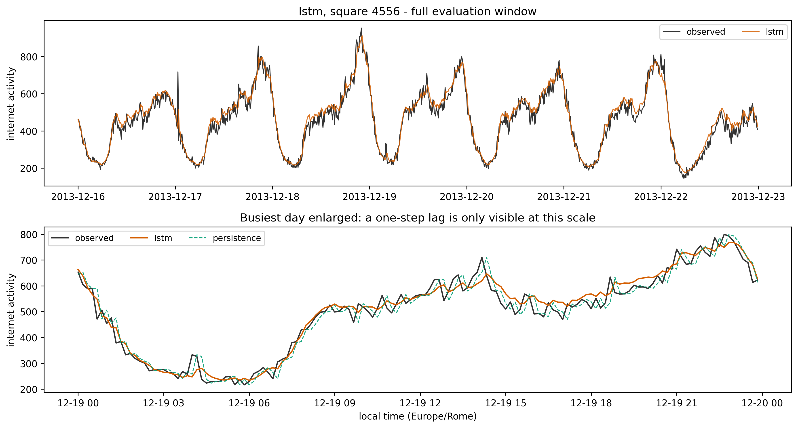
**Figure 18 —** LSTM, square 4556.

### 6.3 Seed variance

The three-seed protocol matters. On square 4159 the LSTM scores an MAE of 21.16 ± 4.59, a relative standard deviation of 22%. On square 4556 it scores 28.85 ± 1.79, against 28.86 for persistence. That gap is much smaller than the spread, so the two cannot be told apart on this evidence. A single-seed result would have been a number with nothing to say about it.

### 6.4 Computational cost

**Table 12 — Computational cost, square 5161, 1,008 one-step forecasts.** Training times **cannot be compared across devices**. The device is in the table itself and not left to a caption.

| Model | Device | Train | Inference | Per step | Parameters |
|---|---|---:|---:|---:|---:|
| harmonic ARIMA | CPU | 18.0 s | 75.2 s | 74.6 ms | 22 |
| LightGBM | CPU | 5.0 s | 0.022 s | 0.022 ms | 19,639 |
| LSTM | GPU (T4) | 9.9 s | 0.041 s | 0.041 ms | 202,369 |
| LSTM ensemble | GPU (T4) | 29.7 s | 0.124 s | 0.123 ms | 607,107 |
| persistence / seasonal naive | CPU | 0.0 s | < 0.001 s | < 0.001 ms | 0 |

**Cost flips between training and deployment.** The most accurate model, and by far the smallest, is also the most expensive to serve. Harmonic ARIMA is about **1,825× slower per forecast** than the LSTM. Adding an observation without refitting still runs a Kalman filter update at every step.

For a single area this is fine. 75 seconds to produce a week of forecasts is well inside a ten-minute budget. At city scale it rules the model out. One forecast for each of the 10,000 grid cells would take **12.4 minutes** at 74.6 ms per step. That is *longer than the ten-minute interval being forecast*, so the model could not keep up with the data in real time. The LSTM would need 0.41 seconds for the same pass. So the ranking by accuracy and the ranking by deployability are opposite.

How long the LSTM takes to train depends so much on the hardware that it changes what is possible. One configuration (window 288, 64 hidden units, 2 layers) was fitted on both machines. The same fit took **2,019 seconds on the CPU and 2.6 seconds on the T4**, a measured **777×** difference. The largest configuration reached in the CPU sweep took **13.8 hours** for a single fit. I never ran it on the GPU, so that number is a CPU cost and not half of a ratio. I abandoned the sweep locally after 16 hours, with two of five stages done. It finished on the GPU in 2.9 minutes. A 288-step recurrence is limited by latency, because each step depends on the last and CPU threads cannot split that up. The process used an average of 0.88 of 8 available cores the whole time, so more cores would not have helped.

---

## 7. Discussion

### 7.1 Did the models learn anything, or just copy the last value?

With a lag-1 autocorrelation of 0.987, a model can get a decent error by learning to repeat its latest input. It would look successful while having learned nothing. I tested for this directly.

The measure is the **copy ratio**. It is the mean distance between a model's forecasts and the persistence baseline, divided by how far the series itself moves between steps. Zero means the two are the same forecast.

**Table 13 — Collapse-to-persistence check, test week.**

| Model | copy ratio (range across areas) | verdict |
|---|---|---|
| persistence | 0.00 | collapsed by definition |
| harmonic ARIMA | 0.54 – 0.64 | independent |
| LSTM | 0.71 – 1.14 | independent |
| LightGBM | 0.77 – 0.93 | independent |
| seasonal naive | 2.70 – 3.68 | independent |

**No model collapsed into persistence.** The closest is harmonic ARIMA on square 4159 at 0.54, which is also its best result. On that area the model really is close to persistence, and it still beats it.

One point about method is worth stating, because the obvious test gives the wrong answer.

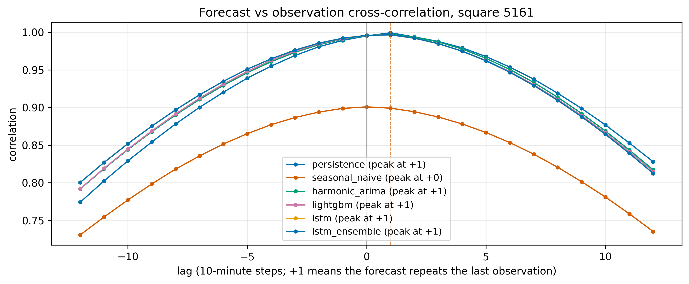

**Figure 19 —** Cross-correlation between forecasts and observations, square 5161. Every model except seasonal naive peaks at lag +1.

When I cross-correlate forecasts with observations, every model, including the best, peaks at **lag +1**. This is *not* evidence of copying. A one-step forecast is built only from observations up to *t*−1. It cannot contain the new change at *t*, so it has to line up slightly better with the previous observation than with the current one. A forecast that peaked at lag 0 on a series this persistent would be the suspicious case, because it would mean the model had access to the current value. The data settles it. Seasonal naive is the only model that peaks at lag 0, and it is clearly the worst forecaster in the study. So the verdict in Table 13 rests on the copy ratio. I report the peak but do not use it as the test.

### 7.2 Where the errors fall

Absolute error grows with traffic level, so every model's error follows the daily cycle. What separates the models is where their error peaks *compared with the others*.

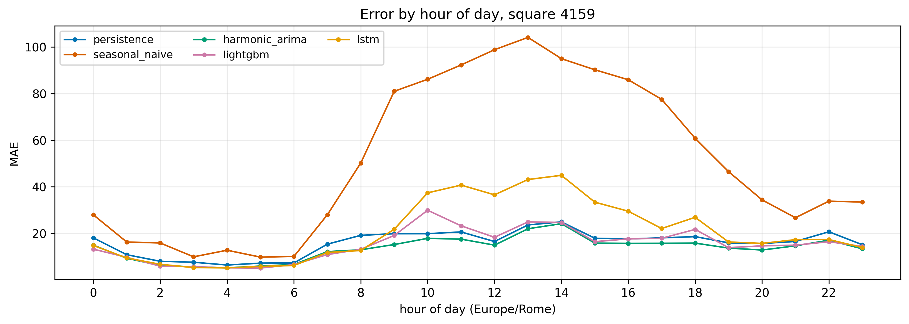

**Figure 20 —** Mean absolute error against hour of day, square 4159, one line per model. The LSTM's extra error is concentrated in the morning.

**Table 14 — Error by day type, test week.**

| Area | Model | Weekday MAE | Weekend MAE | Weekend penalty |
|---|---|---:|---:|---:|
| 5161 | persistence | 88.36 | 103.90 | 1.18 |
| 5161 | harmonic ARIMA | **74.96** | 105.33 | **1.41** |
| 5161 | LightGBM | 82.65 | 96.45 | 1.17 |
| 5161 | LSTM | 77.26 | 89.62 | 1.16 |
| 4159 | persistence | 17.41 | 12.31 | 0.71 |
| 4159 | harmonic ARIMA | 14.32 | 11.87 | 0.83 |
| 4159 | LightGBM | 16.20 | 12.74 | 0.79 |
| 4159 | LSTM | **24.13** | 12.03 | **0.50** |
| 4556 | persistence | 29.53 | 27.19 | 0.92 |
| 4556 | harmonic ARIMA | 25.83 | 25.97 | 1.01 |
| 4556 | LightGBM | 29.14 | 31.91 | 1.10 |
| 4556 | LSTM | 27.54 | 29.01 | 1.05 |

**Table 15 — Worst contiguous six-hour windows, test week.** A `ratio` above 1 means persistence would have done better over exactly that stretch.

| Area | Model | Window start | MAE | persistence MAE | ratio |
|---|---|---|---:|---:|---:|
| 4159 | LSTM | 2013-12-17 10:00 | 52.2 | 20.5 | **2.55** |
| 4159 | LSTM | 2013-12-18 09:50 | 60.2 | 26.4 | **2.28** |
| 4159 | LSTM | 2013-12-19 09:50 | 53.0 | 27.0 | **1.96** |
| 4556 | LightGBM | 2013-12-22 11:50 | 52.2 | 30.0 | 1.74 |
| 4159 | LightGBM | 2013-12-16 10:00 | 33.1 | 19.3 | 1.72 |
| 4556 | LightGBM | 2013-12-16 11:40 | 44.6 | 28.2 | 1.58 |

**The LSTM's poor result on square 4159 is a weekday-morning failure, not a general one.** Its three worst six-hour windows all start at about 09:50 on consecutive weekdays (17, 18 and 19 December). In those windows its error is 2.0 to 2.6 times the persistence error. Its weekday MAE is 24.13 against a weekend MAE of 12.03, the most lopsided split of any model. Persistence, by comparison, has 17.41 and 12.31. The model misses the morning ramp on the area with the least traffic, and it does fine there at weekends.

**Harmonic ARIMA's advantage on square 5161 works the other way: it holds only on weekdays.** It is the best model of all on weekdays (MAE 74.96), but it is worse than persistence at weekends (105.33 against 103.90), a weekend penalty of 1.41. Its overall win on that area comes entirely from working days.

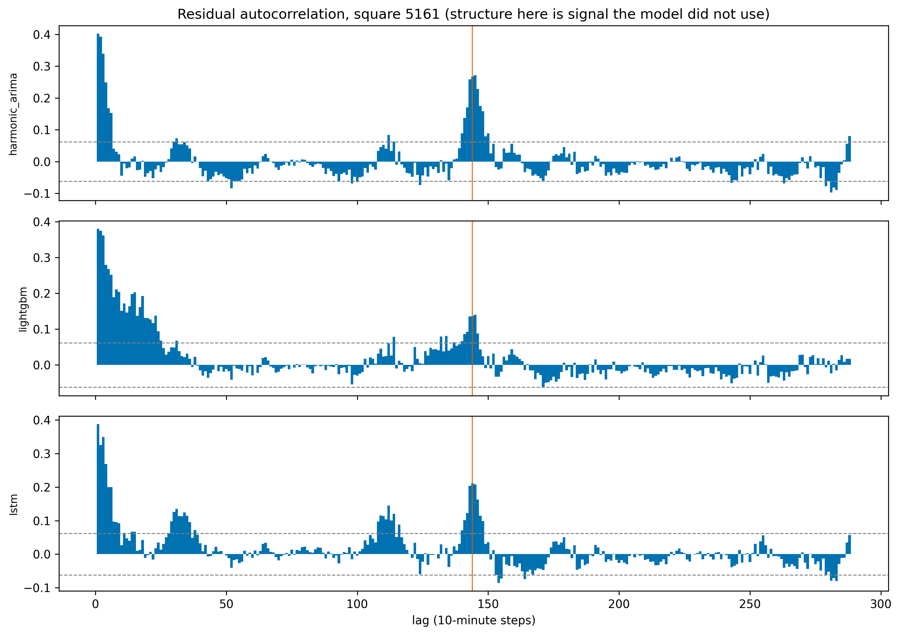

**Figure 21 —** Residual autocorrelation per model, square 5161. Any structure left here is signal the model did not use. The marked line is the daily period.

### 7.3 The holiday stress split

The stress split runs from 23 December to 1 January. It holds four of the eight Italian public holidays in the study period, and I never tuned on it or used it for selection.

**Table 16 — MASE on the held-out stress split, relative to persistence on the same area.**

| Model | 5161 | 4159 | 4556 |
|---|---:|---:|---:|
| persistence (absolute MASE) | 0.198 | 0.124 | 0.206 |
| harmonic ARIMA | +9.0% | **−1.9%** | +7.9% |
| LightGBM | +68.6% | +133.1% | +139.8% |
| LSTM | +78.0% | +95.8% | +103.2% |
| seasonal naive | +538.6% | +204.7% | +144.7% |

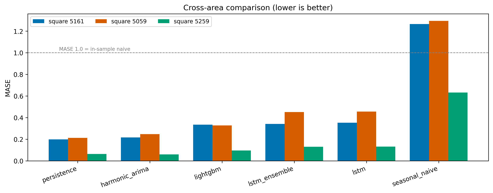

**Figure 22 —** MASE per model on the stress split.

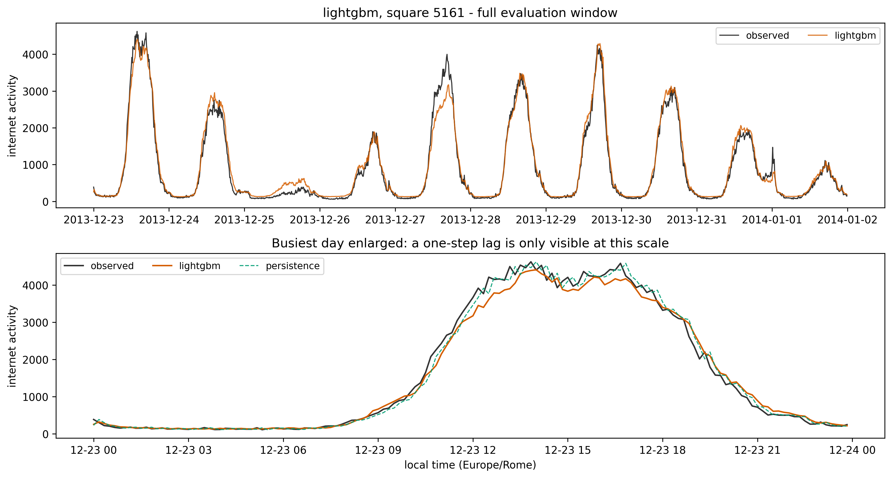

**Figure 23 —** LightGBM on square 5161 over the holiday period, where it gets 68.6% worse than persistence.

**Persistence wins outright on two of the three areas.** Both learned models get much worse. LightGBM is up to 140% worse and the LSTM up to 103% worse. The harmonic model stays within 9% and beats persistence on one area.

The two baselines also move in **opposite directions**, which shows what the holidays do to the series. Persistence gets easier (MASE 0.267 → 0.198 on square 5161) because traffic gets smoother. Seasonal naive falls apart past MASE 1.0 (0.975 → 1.266). That is worse than the in-sample naive forecast it is scaled against. The weekly pattern it relies on is exactly what Christmas and New Year break.

I **predicted LightGBM's failure before running the split**. My design notes say a tree ensemble cannot predict beyond the range of its training targets. They name the stress split as the place where that limit should show. LightGBM is the worst model apart from seasonal naive on all three areas. Its R² drops to 0.474 on square 4159, against 0.878 for persistence. This is the clearest result in the study. The ranking from a well-behaved week does not survive a change in the data. And the model with the most capacity to fit the training data is the one that does worst outside it.

### 7.4 Limitations

1. **I tuned hyperparameters on one area only.** The LSTM's failure on square 4159 is partly a *transfer* result. It took a configuration and epoch count picked on the highest-traffic area. Tuning each area separately was beyond my compute budget. So the evidence cannot separate a limit of the architecture from a failure to transfer.
2. **There is one test week.** The reported results rest on a single seven-day window fixed by the brief. The stress split gives a second, deliberately harder window. Neither replaces repeated testing across many weeks.
3. **The staged search does not give the same answer on different devices.** On the CPU the LSTM sweep chose a sequence length of 288. On the GPU it chose 144. A candidate that stopped at epoch 17 on one device stopped at epoch 2 on the other. Different kernels give slightly different numbers, and early stopping with patience 5 on a noisy validation curve turns that into a different architecture choice. The selection should not be presented as inevitable.
4. **There are only three areas.** Any conclusion about how performance changes with area characteristics rests on three points.
5. **The models are univariate.** They use no information from other cells or from outside sources like weather or events. The anomaly analysis showed that holidays have a measurable effect, and the literature [3] shows that spatial information helps.
6. **The ARIMA order was chosen on a margin within noise.** I picked ARIMA(3,0,1) over ARIMA(1,0,1) on a validation MAE difference of 0.08. Two extra parameters are not justified by that. I followed the selection rule set out in advance and did not override it afterwards.

---

## 8. Conclusion and Future Work

I compared three sequential models for one-step-ahead forecasting of mobile internet traffic in three areas of Milan, against persistence and seasonal-naive baselines.

The **dynamic harmonic regression did best**. It had the lowest mean MASE (0.202) and the best result on two of the three test-week areas, and it beat persistence by 15.1% on average. It does this with 22 parameters, against 19,639–21,010 for LightGBM and 202,369 for the LSTM. On the third area a three-seed LSTM ensemble does better. So no single model wins everywhere. That is my answer to the second half of the research question: the ranking depends on the area.

Three findings are worth taking forward.

**Complexity paid off only while the data stayed the same.** On the held-out holiday period, persistence wins two of three areas outright. Both learned models get 69–140% worse, while the smallest model stays within 9%. The ranking from the test week does not survive a change in the data.

**The baseline is part of the result.** With a lag-1 autocorrelation of 0.987, persistence gets a MASE of 0.145–0.302 and an R² above 0.98. All three models beat it on the test week, but the margins are modest, and over the holidays it wins. A study that only reported model errors, without this floor, would show a result that looks respectable and is worse than doing nothing. This supports the qualification that Azari *et al.* [2] attach to their own headline finding. They say there are conditions where the simpler statistical model is close to optimal at far lower complexity. It does not support the headline itself.

**Cost flips between training and deployment.** The most accurate and smallest model is about 1,825 times slower to serve than the LSTM, and at city scale it could not keep up with the interval it forecasts. The LSTM, meanwhile, can only be trained in reasonable time on a GPU. An identical fit took 2,019 seconds on a CPU and 2.6 seconds on a T4. A single "training time" column with no device attached would have meant nothing.

### Future work

- **Tune each area separately.** This would separate the LSTM's architectural limits from a failure to transfer. It is the most useful next step, because it deals directly with the study's main limitation.
- **Try longer horizons.** Every conclusion here is for a ten-minute horizon, where persistence is strong. The ranking would probably change at one hour or one day. How the models compare depends on the horizon, and it is not a fixed property of the methods.
- **Add holiday-aware features or a regime-switching model.** The failure on the stress split is specific and predictable, not random.
- **Use information from neighbouring cells.** Nearby cells are strongly correlated, and Zhang and Patras [3] show that spatial structure helps a lot. A graph or convolutional model could use what the univariate setup throws away.

---

## References

[1] G. Barlacchi, M. De Nadai, R. Larcher, A. Casella, C. Chitic, G. Torrisi, F. Antonelli,
A. Vespignani, A. Pentland, and B. Lepri, "A multi-source dataset of urban life in the city of
Milan and the Province of Trentino," *Scientific Data*, vol. 2, art. 150055, 2015.
doi: 10.1038/sdata.2015.55

[2] A. Azari, P. Papapetrou, S. Denic, and G. Peters, "Cellular traffic prediction and
classification: A comparative evaluation of LSTM and ARIMA," in *Discovery Science (DS 2019)*,
Lecture Notes in Computer Science, Springer, 2019, pp. 129–144.
doi: 10.1007/978-3-030-33778-0_11

[3] C. Zhang and P. Patras, "Long-term mobile traffic forecasting using deep spatio-temporal
neural networks," in *Proc. 19th ACM Int. Symp. Mobile Ad Hoc Networking and Computing
(MobiHoc '18)*, Los Angeles, CA, USA, 2018, pp. 231–240. doi: 10.1145/3209582.3209606

[4] G. L. Santos *et al.*, "Predicting short-term mobile Internet traffic from Internet activity
using recurrent neural networks," *International Journal of Network Management*, vol. 32, no. 3,
art. e2191, 2022. doi: 10.1002/nem.2191

[5] X. Wang, Z. Wang, K. Yang, Z. Song, C. Bian, J. Feng, and C. Deng, "A survey on deep learning
for cellular traffic prediction," *Intelligent Computing*, vol. 3, art. 0054, 2024.
doi: 10.34133/icomputing.0054

[6] R. J. Hyndman and G. Athanasopoulos, *Forecasting: Principles and Practice*, 3rd ed.
Melbourne, Australia: OTexts, 2021. [Online]. Available: https://otexts.com/fpp3/

[7] K. Bandara, R. J. Hyndman, and C. Bergmeir, "MSTL: A seasonal-trend decomposition algorithm
for time series with multiple seasonal patterns," *International Journal of Operational
Research*, vol. 52, no. 1, 2025.

[8] S. Makridakis, E. Spiliotis, and V. Assimakopoulos, "The M5 competition: Conclusions,"
*International Journal of Forecasting*, 2022. doi: 10.1016/j.ijforecast.2022.04.006

[9] G. Ke, Q. Meng, T. Finley, T. Wang, W. Chen, W. Ma, Q. Ye, and T.-Y. Liu, "LightGBM: A highly
efficient gradient boosting decision tree," in *Advances in Neural Information Processing Systems
30 (NIPS 2017)*, Long Beach, CA, USA, 2017, pp. 3146–3154.

[10] R. J. Hyndman and A. B. Koehler, "Another look at measures of forecast accuracy,"
*International Journal of Forecasting*, vol. 22, no. 4, pp. 679–688, 2006.
doi: 10.1016/j.ijforecast.2006.03.001

[11] Telecom Italia, "Telecommunications — SMS, Call, Internet — MI," Harvard Dataverse, 2015.
doi: 10.7910/DVN/EGZHFV

[12] Telecom Italia, "Milano Grid," Harvard Dataverse, 2015. doi: 10.7910/DVN/QJWLFU

[13] Polars contributors, "Polars: DataFrames for the new era." [Online]. Available:
https://pola.rs/

[14] S. Seabold and J. Perktold, "statsmodels: Econometric and statistical modeling with Python,"
in *Proc. 9th Python in Science Conf. (SciPy 2010)*, 2010.

[15] A. Paszke *et al.*, "PyTorch: An imperative style, high-performance deep learning library,"
in *Advances in Neural Information Processing Systems 32 (NeurIPS 2019)*, 2019, pp. 8024–8035.

---

## Appendix A — Reproducibility

You can reproduce the analysis from a clean checkout without the 19.38 GiB download. Four files are under version control for this: the extracted series (283 KB), the study-area selection, the tuned hyperparameters, and the prediction series (312 KB).

```bash
git clone <repository URL> && cd milan_traffic_forecasting
python -m venv .venv && .venv/Scripts/activate      # source .venv/bin/activate on Linux
pip install -r requirements.txt

python run.py test                     # 501 tests
python run.py evaluate --split test    # baseline metrics from the committed series
python run.py results --split test     # figures and diagnostic tables
python run.py results --split stress
```

**Verification.** I ran a fresh clone in an empty virtual environment and confirmed that it reproduces every metric and every summary in this report **exactly**, not just to three significant figures. The only differences between regenerated and committed files are the wall-clock timing columns and line endings.

Three stages cannot run from the committed files, for these reasons. Ingest needs the 19.38 GiB of raw text, which I cannot redistribute. Part of the exploratory analysis needs the 341 MB full matrix, which is too large to commit. The LSTM final fits need a CUDA device, because on a CPU the nine fits take about 31 hours. I committed the prediction series because of that last limit.

I fixed the seeds for Python, NumPy and PyTorch, and I record library versions and hardware next to the results. Harmonic ARIMA and LightGBM gave bit-identical results on two different machines. The LSTM did not, for the reason given in Section 7.4.

## Appendix B — Supplementary figures

The analysis produces the following figures. The body of the report refers to them as a group and not one by one. All are at 300 dpi in `report/figures/`.

| Figure family | Files | Shows |
|---|---|---|
| Error-by-hour | `error_by_hour_test_{5161,4556}.png` | Error against hour of day for the two areas not shown as Figure 20 |
| Error heatmaps | `error_heatmap_test_{area}_{model}.png` (9) | Error over day-of-week × hour-of-day per model per area |
| Residual ACF | `residual_acf_test_{4159,4556}.png` | Residual autocorrelation for the two areas not shown as Figure 21 |
| Cross-correlation | `cross_correlation_test_{4159,4556}.png` | Copying diagnostic for the two areas not shown as Figure 19 |
| Stress forecasts | `forecast_stress_{area}_{model}.png` (9) | All three models on all three areas over the holiday period |

## Appendix C — Declaration on the use of AI tools

AI was used to help interpret and clarify the project requirements, which supported effective planning and enabled me to break the project into manageable phases. The implementation, development decisions, and final work were completed and reviewed by me.

---

**Source code:** `https://github.com/Mahamatbt/milan_traffic_forecasting`
**Demonstration video:** `https://youtu.be/Mn7JPndRAu0`
